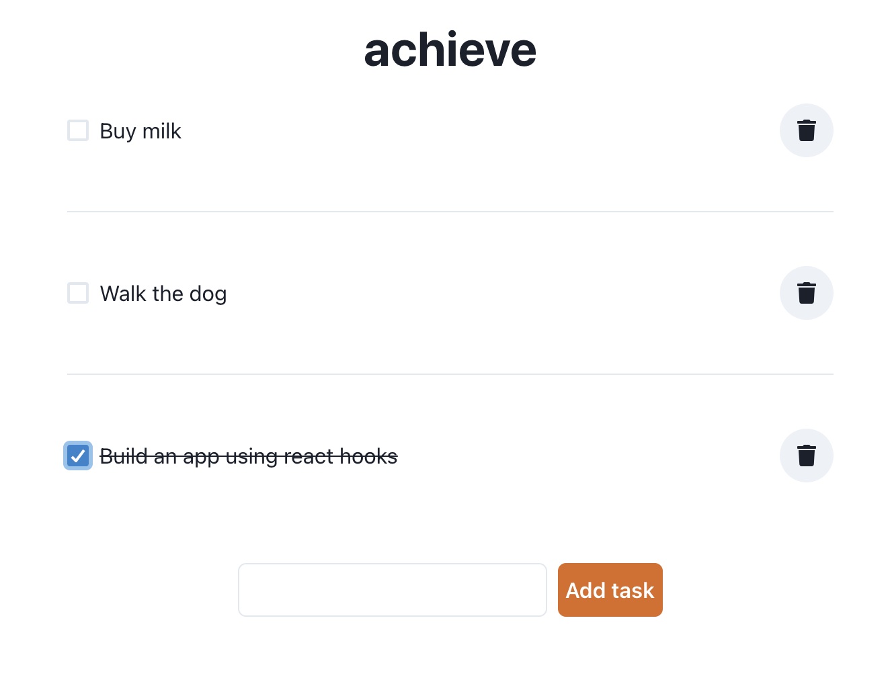

# achieve

achieve is a very simple todo-app built using:

* [Create React App](https://create-react-app.dev/)
* [Chakra UI](https://chakra-ui.com/)

The application is only for reference as it does not store any state between reloads.

